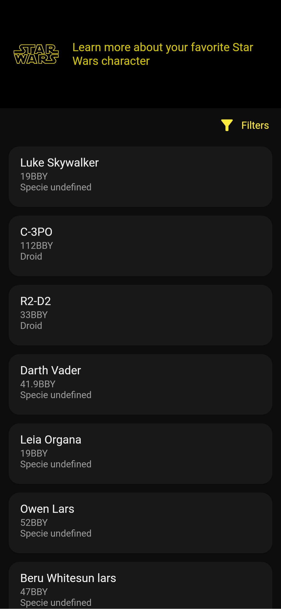
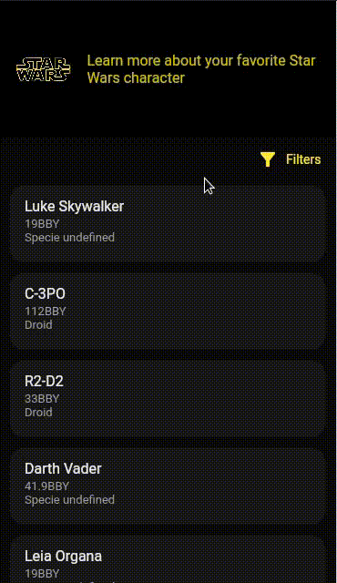
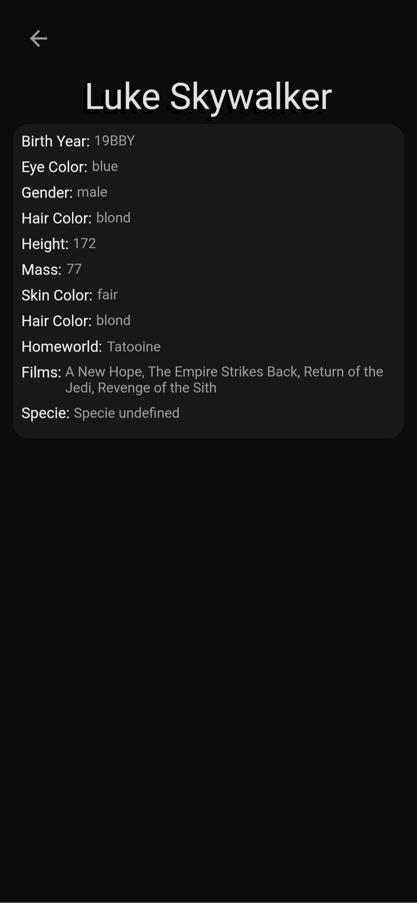
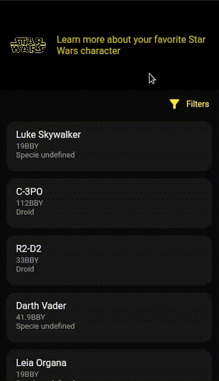

# STAR WARS APP

Este é um aplicativo (web first) que exibe informações sobre os personagens da saga Star Wars.

- [Acessar aplicação funcionando →](https://starwars-s.web.app/#/)

 

> API usada: https://swapi.dev/documentation#people

 

## **Informações técnicas**
----
 

Este projeto foi desenvolvido utilizando Dart e Flutter, nas seguintes versões:
- Dart: 2.18
- Flutter: 3.3
- Testes realizados em: Chrome (Web)

 
Este projeto usa as seguintes dependências:

- Dio: para realizar requisições http
- Get It: para injeções de dependência.

 

Como arquitetura do projeto foi aplicado o MVC e um pouco de Clean Archicteture (de uma forma mais simplificada), devido ao tamanho do projeto, mas buscando um baixo acoplamento do código, com camadas definidas e classes objetivas, e conforme as boas práticas de desenvolvimento, facilitando reuso, testes, e manutenção. Para controle de estado foi utilizado uma opção nativa - o ValueNotifier -, que é bem otimizado, contribue para a performace, manutenção e legibilidade, sendo assim a melhor opção para este projeto. Para injeção de dependencias foi usado uma dependencia - Get It -, que é simples e funciona muito bem para o projeto, não afetando a perfomance.

 

Para o design foi escolhido algo que remetesse as cores do universo Star Wars, sendo assim escolhidos o Preto e amarelo.

 

## **Fluxo de interação**
----
 

 ###  **| 1. Home Page**

 

Nesta tela, é exibido a lista com os personagens dos filmes, conforme buscado na API. Até o momento é exibido apenas a primeira pagina da busca da API. 

 

O usuario tambem tem a opção para filtrar a lista por filme. Quando usa o filtro por filme, a lista exibe todos os personagens referentes ao filme, de uma vez. Sem limitação de paginas.

 

 

 ###  **| 2. Details Page**

 
Ao clicar em um dos personagens da lista, abre uma nova pagina que contem todas as informações do mesmo.

 

 

 Os campos _'Homeworld'_ and _'Specie'_, demora um pouco a aparecer por que é buscado a informação usando a url que é retornada. Portanto, são feitas varias requisições simultaneas para exibir todos os dados do personagem.

 
 

## **Testes**
----

 
Foram realizados testes unitários das camadas datasource, repository e controller, o que ajudou num desenvolvimento mais rápido, mapeando todos os caminhos possiveis ao realizar as requisições Http, localizar erros, e acompanhar o funcionamento das funcionalidades no código.

 
 

## **Manutenção e Melhorias**
----

 

Os proximos passos para este projeto é inserir imagens na página de detalhes  do personagem. Sugiro utilizar uma API de pesquisa de imagens, que poderia seguir o seguinte fluxo:

 - O usuario clica no personagem e abre a página de detalhes
 - A aplicação pega o campo nome do personagem selecionado, e faz uma requisição na API de pesquisa passando esse nome, e retorna a url da primeira imagem obtida na busca.
 - Exibe esta imagem da url na página de detalhes do personagem, usando talvez o widget _'Image.network'_ 

Como opções de API para essa feature sugiro uma destas duas opções: 

- A API do Google ([Custom Search API](https://developers.google.com/custom-search/v1/reference/rest?hl=pt-br)), que permitiria uma quantidade muito grande de requisições, mas que requer uma requisição mais avançada, com muitos parametros e informações.
- [SerpApi](https://serpapi.com/images-results), que utiliza a API do google informada acima, mas com mais simplicidade de uso, e com limitação de no máximo 100 requisições ao mês.

 
  

 ###  **| Testes**
 
Nos testes, uma das melhorias é realizar tambem os testes de integração e de widgets, para ficar mais completo. Nos testes unitários já realizados, falta mapear os caminhos não-felizes, usando mocks. Para isso precisaria de um pouco mais de tempo para desenvolver, usando o mockito ou mocktail. Criando mocks para simular requisições falhas, usando as mais diversas possibilidades, e assim tratando-as.

Nesse sentido, talvez fosse interessante criar repositories abstratos para facilitar estes testes, e inserindo-os no projeto, seguindo assim mais de perto o Clean Archtecture. Até o momento, o projeto foi desenvolvimento de forma mais simples devido isso ter sido um dos requisitos passados. Mas conforme o projeto for crescendo, essa mudança se fará necessária.

 

## **Acesse a aplicação agora**
----

 

- [Acessar aplicação funcionando →](https://starwars-s.web.app/#/)